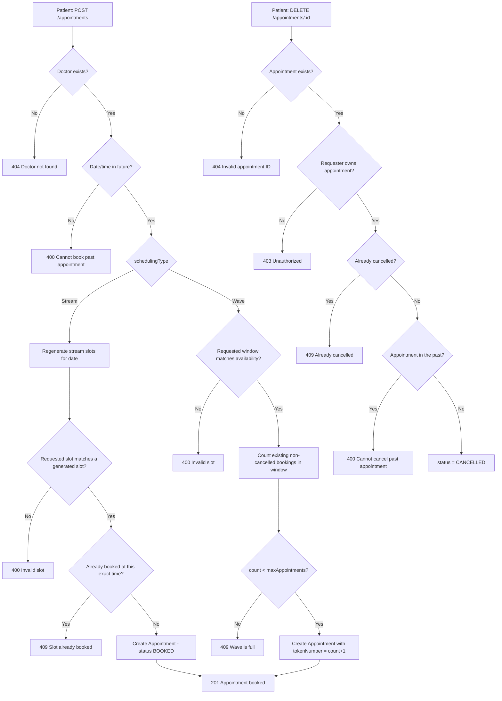

## Appointment booking workflow

```mermaid
flowchart TD
    A[Patient: POST /appointments] --> B{Doctor exists?}
    B -->|No| B1[404 Doctor not found]
    B -->|Yes| C{Date/time in future?}
    C -->|No| C1[400 Cannot book past appointment]
    C -->|Yes| D{schedulingType}

    D -->|Stream| E[Regenerate stream slots for date]
    E --> F{Requested slot matches a generated slot?}
    F -->|No| F1[400 Invalid slot]
    F -->|Yes| G{Already booked at this exact time?}
    G -->|Yes| G1[409 Slot already booked]
    G -->|No| H[Create Appointment - status BOOKED]

    D -->|Wave| I{Requested window matches availability?}
    I -->|No| I1[400 Invalid slot]
    I -->|Yes| J[Count existing non-cancelled bookings in window]
    J --> K{count < maxAppointments?}
    K -->|No| K1[409 Wave is full]
    K -->|Yes| L[Create Appointment with tokenNumber = count+1]

    H --> M[201 Appointment booked]
    L --> M

    N[Patient: DELETE /appointments/:id] --> O{Appointment exists?}
    O -->|No| O1[404 Invalid appointment ID]
    O -->|Yes| P{Requester owns appointment?}
    P -->|No| P1[403 Unauthorized]
    P -->|Yes| Q{Already cancelled?}
    Q -->|Yes| Q1[409 Already cancelled]
    Q -->|No| R{Appointment in the past?}
    R -->|Yes| R1[400 Cannot cancel past appointment]
    R -->|No| S[status = CANCELLED]

```