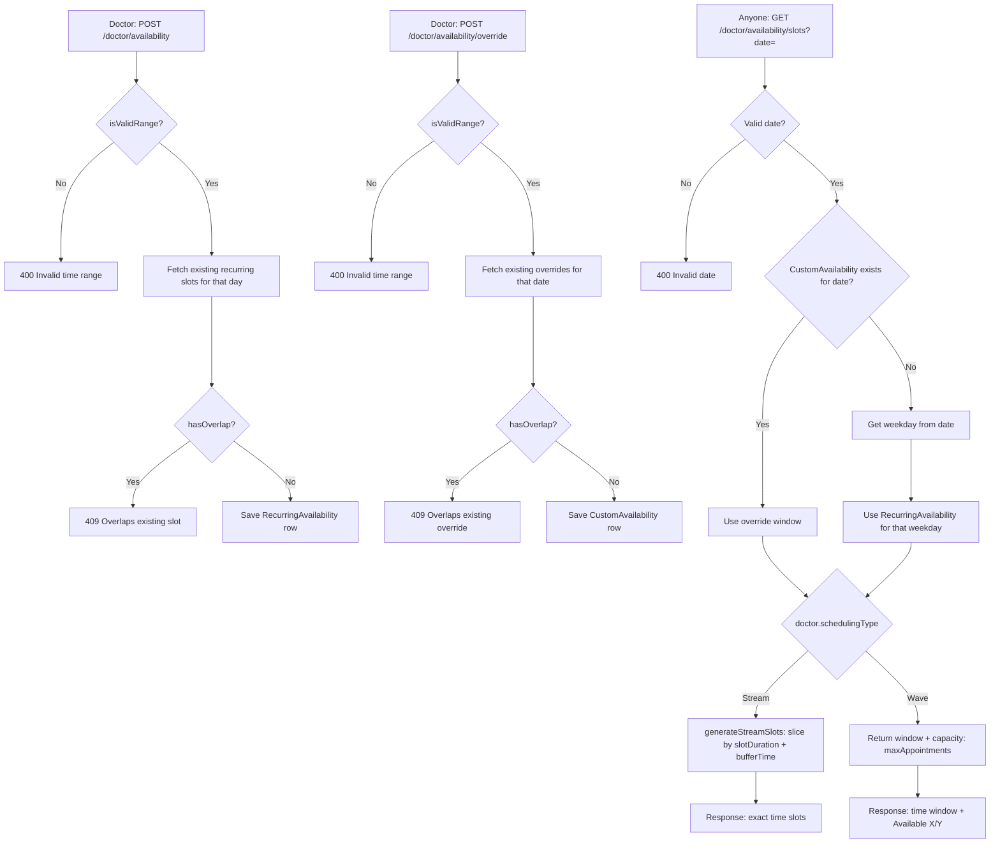

## Availability & Slots Flow

```mermaid
flowchart TD
    A[Doctor: POST /doctor/availability] --> B{isValidRange?}
    B -->|No| B1[400 Invalid time range]
    B -->|Yes| C[Fetch existing recurring slots for that day]
    C --> D{hasOverlap?}
    D -->|Yes| D1[409 Overlaps existing slot]
    D -->|No| E[Save RecurringAvailability row]

    F[Doctor: POST /doctor/availability/override] --> G{isValidRange?}
    G -->|No| G1[400 Invalid time range]
    G -->|Yes| H[Fetch existing overrides for that date]
    H --> I{hasOverlap?}
    I -->|Yes| I1[409 Overlaps existing override]
    I -->|No| J[Save CustomAvailability row]

    K[Anyone: GET /doctor/availability/slots?date=] --> L{Valid date?}
    L -->|No| L1[400 Invalid date]
    L -->|Yes| M{CustomAvailability exists for date?}
    M -->|Yes| N[Use override window]
    M -->|No| O[Get weekday from date]
    O --> P[Use RecurringAvailability for that weekday]

    N --> Q{doctor.schedulingType}
    P --> Q
    Q -->|Stream| R[generateStreamSlots: slice by slotDuration + bufferTime]
    Q -->|Wave| S[Return window + capacity: maxAppointments]

    R --> T[Response: exact time slots]
    S --> U[Response: time window + Available X/Y]
```