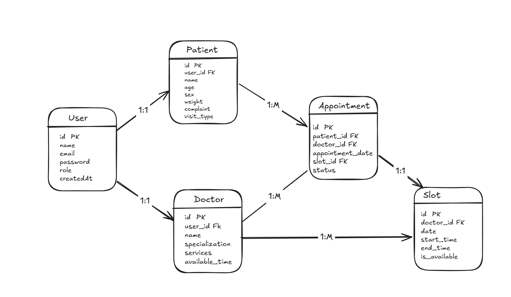

# ER Diagram 

# Entities

## Doctor

Represents a healthcare provider who offers appointment slots.

| Field | Description |
|--------|-------------|
| doctor_id | Primary Key |
| name | Doctor's name |
| specialization | Medical specialization |
| services | Available service |
| available_time | Available time |

---

## Patient

Represents a user who books appointments.

| Field | Description |
|--------|-------------|
| patient_id | Primary Key |
| name | Patient name |
| age | Patient age |
| sex | Patient sex |
| weight | Patient weight |
| complaint | Complaint type |
| visit_type| Patient visit type |

---

## Slot

Represents an available time slot created by a doctor.

| Field | Description |
|--------|-------------|
| slot_id | Primary Key |
| doctor_id | Foreign Key → Doctor |
| date | Appointment date |
| start_time | Start time |
| end_time | End time |
| is_available | Indicates whether the slot is available |

---

## Appointment

Represents a confirmed booking between a patient and a doctor through a slot.

| Field | Description |
|--------|-------------|
| appointment_id | Primary Key |
| patient_id | Foreign Key → Patient |
| doctor_id | Foreign Key → Doctor |
| appointment_date | Appointment date of patient |
| slot_id | Foreign Key → Slot |
| status | Booked / Cancelled / Completed |

---

# Relationships

## Doctor → Slot

- One doctor can create many slots.
- One slot belongs to one doctor.

---

## Patient → Appointment

- One patient can have multiple appointments.
- One appointment belongs to one patient.

---

## Slot → Appointment

- A slot can be booked at most once.
- One appointment uses exactly one slot.

---
