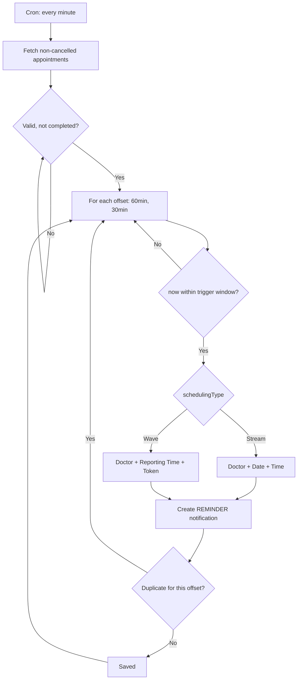

## Reminder System Flowchart

```mermaid
flowchart TD
    A[Cron: every minute] --> B[Fetch non-cancelled appointments]
    B --> C{Valid, not completed?}
    C -->|No| C

    C -->|Yes| D[For each offset: 60min, 30min]
    D --> E{now within trigger window?}
    E -->|No| D

    E -->|Yes| F{schedulingType}
    F -->|Stream| G[Doctor + Date + Time]
    F -->|Wave| H[Doctor + Reporting Time + Token]

    G --> I[Create REMINDER notification]
    H --> I
    I --> J{Duplicate for this offset?}
    J -->|Yes| D
    J -->|No| K[Saved] --> D
```